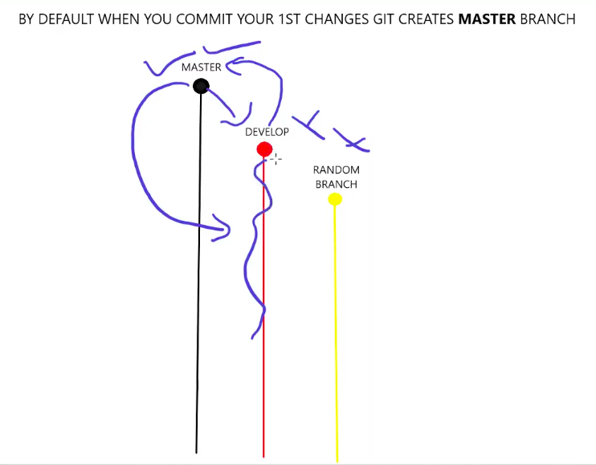
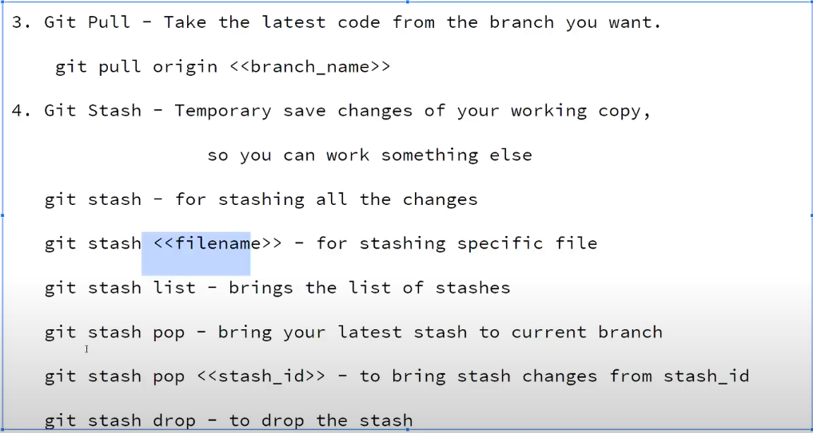

---
title: "Git and Github"
mathjax: true
layout: post
comments: true
---

# Github & Git

Resource: [https://www.youtube.com/watch?v=Pp08lcCOwd8](https://www.youtube.com/watch?v=Pp08lcCOwd8)

# Github — Distributed Version Control System

---

```
Central											
| * --> * --> * ---> * ---> (*) |(Final Node)
		|	   \             /
		* ---->	* --> * --> * (Distributed)
	          Merge                            
```

---

## Some commands

---

- git init
- git status
- git remove [double hyphen]cached <file> **— To unstage**
- git restore — to get back previously commited file
- git commit -a (short git add + commit)
- git push origin [*branch name*] — send *branch name* to origin (in this case - website)
- git merge [*branch-name*] — merge to current branch
- git pull origin [*branch-name*]
- git branch -D *branch-name* —> To delete

---

## Pushing code to local repositry

---

- Add stuff → git add . (adds stuff to staging area)

```
<---- git [remove --cached]/reset <--														
|                                   |														
Files -> |------ Staging Area ------|
				  |															
          :Commit:|
          		  : -> Ready to go to Local Repo.                                           
```

## Branching

---

- MASTER - containing latest working + tested code [works as a backup]
- DEVELOP - Test and merge to MASTER
- RANDOM BRANCH — For specific tasks

    

## Git Stash

---

- git stash [hyphen]u "— why is u being used?"
    - Saves the file into temporary storage
- git stash list
- git stash pop

    

## Queries

---

— Don't delete .git ~~file~~ folder? what does it contain? META DATA about the git

— ~~Is there any special use of github desktop?~~ or CLI is good enough?

— HTML (everything should be in lower case?)

— Is SSH good? shifted to todos

— Upstream/Downstream concept for "git stash -u"

## Todos

---

- [ ] Checkout SSH workflow
